# Cerebral Palsy Diagnosis with Data Science and Machine Learning Techniques

## Abstract

Cerebral palsy (CP), primarily caused by brain damage before or shortly after birth, affects a significant majority of children, with spastic CP being the most prevalent subtype. This disorder leads to muscle stiffness and movement difficulties, impacting the quality of life. 

Gait analysis, a key tool in clinical assessment, plays a crucial role in diagnosing and managing CP. Despite its advantages, current gait classification heavily relies on subjective clinician judgment, leading to variability in diagnoses. 

This study introduces an objective approach by evaluating various supervised machine learning algorithms for classifying diplegic and hemiplegic gait patterns in CP children, a task with limited prior research. Utilizing a comprehensive set of gait parameters, including Spatio-Temporal, Kinematic, Kinetic, and Ground Reaction Forces data, we demonstrate that the K-Nearest Neighbor (KNN) and Support Vector Machine (SVM) models significantly outperform other classifiers in accuracy. Our findings, indicating SVM and KNN models achieving up to 92.94% accuracy, highlight the potential of machine learning in enhancing diagnostic precision, reducing labor costs, and improving patient care in CP.

## Introduction

Cerebral Palsy (CP) is a neurological disorder caused by brain damage before or shortly after birth, leading to impaired motor function and muscle coordination. Diagnosis often involves gait analysis, which assesses walking patterns through measurements of movement, joint motion, forces, and muscle activity. While there's no cure for CP, treatments like orthopedic surgery and selective dorsal rhizotomy can improve symptoms and motor skills, making accurate diagnosis crucial for effective intervention. 

This study leverages supervised machine learning algorithms to enhance the precision of CP diagnosis by classifying diplegic and hemiplegic gait patterns in children. Unlike previous research, which primarily focused on Spatiotemporal parameters, our approach utilizes a comprehensive set of gait parameters, including Kinematics, Kinetics, and Ground Reaction Forces, to identify the most effective classification algorithm. This method aims to support clinicians in making more confident diagnoses, thereby optimizing treatment plans for each patient.

### Problem Statement

Accurate diagnosis is fundamental for effective treatment plans, especially in conditions like cerebral palsy where motor function is affected. Traditional diagnostic methods, particularly subjective assessments of gait patterns by experts, face several challenges, including inconsistency, the potential for error, and the variability inherent in human judgment. Moreover, the scarcity of experienced professionals, high labor costs, and the extensive time required to analyze large datasets further complicate the diagnostic process. 

This project addresses these issues by proposing an automated diagnostic approach that leverages machine learning for objective, reproducible, and efficient analysis. Such a method not only promises to reduce labor costs and expedite dataset processing but also aims to standardize the diagnosis of CP, highlighting the project's significance in enhancing patient care through technology.

### Objective

This project aims to enhance the accuracy of cerebral palsy diagnosis through the innovative use of machine learning in gait analysis. The primary objectives include preparing and preprocessing datasets for analysis, exploring various classification paradigms to assess their effectiveness in automatic gait analysis, and identifying the most effective models for distinguishing between diplegic and hemiplegic (right and left) gait patterns in children. The study will experiment with different feature sets and evaluate model performance using a variety of hold-out and cross-validation techniques, ultimately contributing to the development of more precise diagnostic tools for cerebral palsy.

### Dataset

This study utilizes an extensive gait dataset from the Polytechnic University of Milan's gait lab, compiled using ELITE and SMART systems. It encompasses all necessary parameters for diagnosing various gait pathologies, except for EMG data. It includes spatiotemporal metrics (e.g., speed, cadence, cycle time), kinematics data (pelvic tilt, hip rotation, knee flexion), kinetics (hip flexion-extension moment, ankle power), and ground reaction forces. This data has been processed and formatted for analysis and model training using MATLAB. Due to privacy constraints, the dataset is not publicly shared in the repository. Interested parties can contact the [Author](https://www.linkedin.com/in/hamidrezarahimi/) for potential access to sample data under specific conditions. 

## Exploratory Data Analysis and Preprocessing

Exploratory Data Analysis (EDA) is a foundational step in data science to understand the datasets' underlying patterns, characteristics, and anomalies using visualizations and descriptive statistics. It helps in identifying trends, outliers, and the distribution of data, which are crucial for informing further analysis and model building.

Data preprocessing is a critical process that involves preparing raw data for model training. It includes cleaning (removing irrelevant or duplicate data), instance selection, normalization (scaling data to a standard range), transformation (converting data into a suitable format), feature extraction (identifying new relevant features from existing data), and feature selection (selecting the most relevant features for the model). The goal of preprocessing is to produce a refined, final training set that enhances the performance and accuracy of machine learning models by eliminating noise and irrelevant information.

### Handling Outliers

Outliers are data points that significantly deviate from the rest of the dataset, potentially arising from measurement errors, anomalies, or natural variation. Their presence can skew the analysis, leading to biased models that do not represent the underlying data trend. It's crucial to address outliers to enhance model accuracy and allow clearer data visualization. In the provided graph, showcasing the right hip flexion-extension moment, the purple plot stands out as an outlier, obscuring the collective trend of the data:

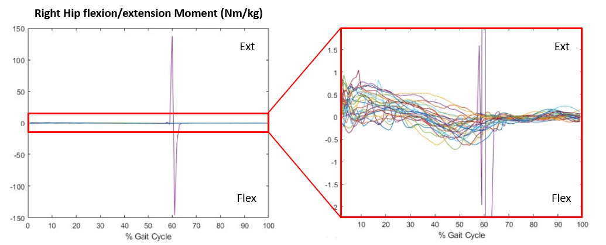

For this study, outliers were identified and removed through meticulous inspection of visualizations. While automatic methods exist, such as using 1.5 times the interquartile range (IQR) to set thresholds, they were deemed too aggressive, excessively reducing the dataset size. Thus, a manual examination was employed, made feasible by the manageable size of the dataset, ensuring that the remaining data accurately represented the true gait characteristics.

### Handling Missing Data

Handling missing data requires a nuanced approach, understanding its representation, and the reasons behind its absence, as it can introduce bias and affect predictions. In our dataset, missing values, indicated by NaNs and zeros, are dealt with judiciously. For samples with extensive missing data, removal is the chosen strategy, while for those with minimal gaps, interpolation is employed. Spatio-temporal gaps are filled with class averages, and gait pattern gaps through 'Nearest' interpolation—using the closest non-missing values. This maintains data integrity without introducing excessive variability, as shown in the before-and-after interpolation graphs of hip flexion/extension:

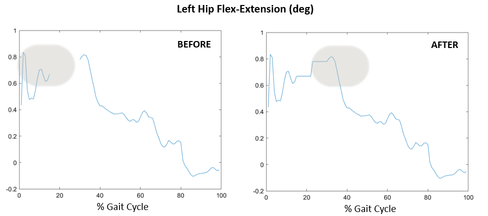

A summary check confirms the elimination of missing values post-process.

### Normalization

Normalization, crucial in data preparation, scales variables for comparability, benefiting machine learning models like SVM and KNN that are sensitive to data scale. For normally distributed data, z-score normalization shifts the mean to zero and scales the distribution to a standard deviation of one, as shown below:

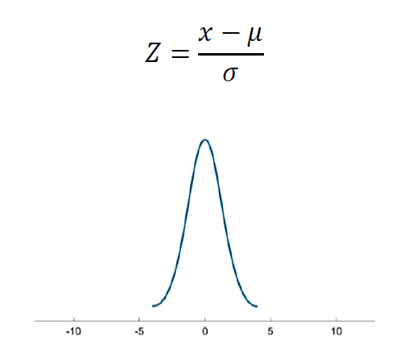

Post-normalization, variables retain the distribution's shape but now range from approximately -3 to 3. These transformed values lack inherent meaning and are used solely for algorithmic training. Here is an example:

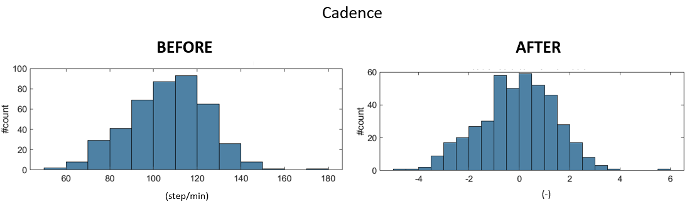

For spatiotemporal variables like step length, standardizing against the subject's height enables comparisons across different statures (e.g. comparing subjects with differing heights):

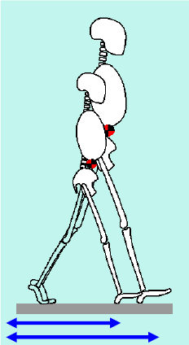

Height normalization precedes z-score application, ensuring a consistent scale across all measures after normalization.

### Feature Engineering

Feature engineering is the process of transforming raw data into variables that can better represent the underlying problem to predictive models. It's a blend of art and science where domain knowledge is crucial.

In our project, we visualized the raw variables to identify potential new features. For instance, the ankle power patterns, as depicted in the following graphs, suggested that the maximum peak of ankle power could distinguish between different types of gait:

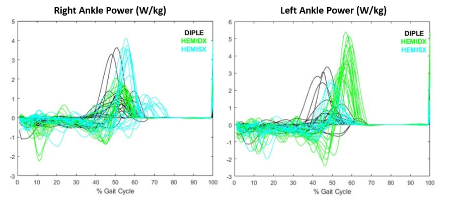

The validity of these new features was confirmed using statistical tests such as ANOVA, illustrated in the following figures, which showed significant differences in the new features across groups.

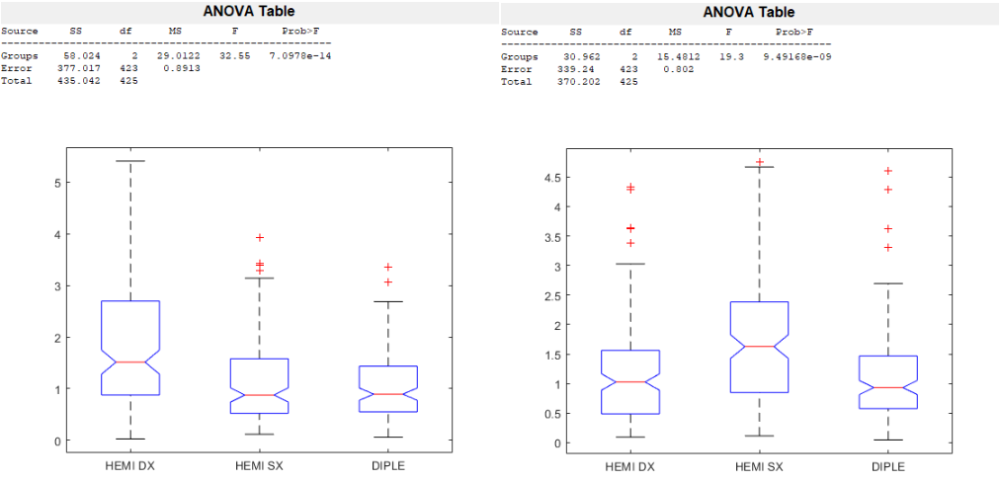

We select features based on their variance, unique information, and relevance to the response variable. Features that pass the qualitative tests and show statistical significance are retained to enhance the model's predictive ability. This iterative process of feature creation and selection, informed by both data and domain expertise, is crucial to developing robust models.

### Feature Selection

Feature selection sharpens models by retaining valuable predictors and discarding extraneous ones, enhancing interpretability and computational efficiency. This process can employ various methods, such as wrapper, embedded, and filter techniques.

Wrapper methods assess different feature combinations to optimize model performance, as illustrated by the following diagram:

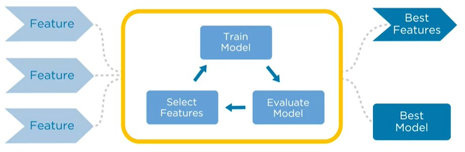

Embedded methods integrate feature selection within model training, emphasizing useful predictors, as shown below:

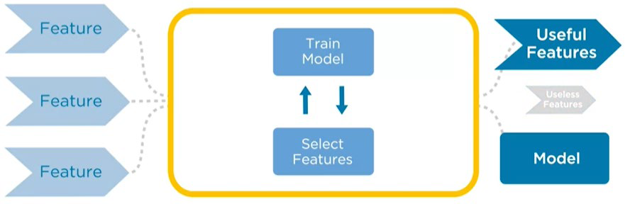

Filter methods, depicted in the following diagram, utilize statistical properties of features prior to model training, often in conjunction with other methods:

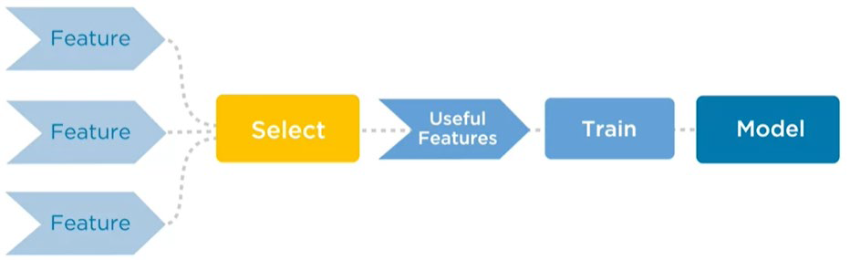

For instance, variance thresholding, a filter technique, selects features with significant variance—indicating their potential predictive power. The proportion of variance retained by selected features is key, intending to preserve a substantial amount of total variance:

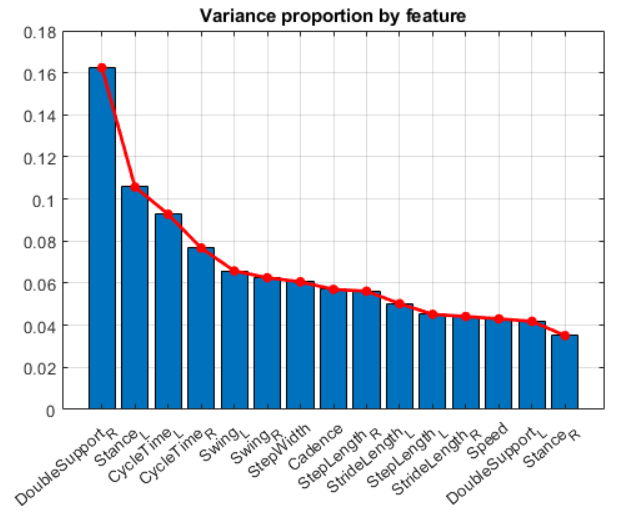

Covariance and correlation analysis, another filter method, evaluate the strength of relationships between predictors and the response. A scatter plot can reveal the distinctness of classes based on selected features, indicating strong predictive power. Here is an example of such a scatter plot using three features with the highest correlation value:

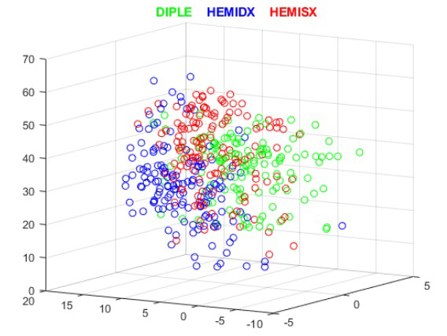

The 'Stance Ratio', one of the chosen features, demonstrates distinct distributions across classes in a box plot, signifying its predictive usefulness:

Ultimately, the model incorporated 500 features, selected through MRMR filter methods, balancing various data patterns and engineered features. This approach proved more effective than wrapper methods, which did not enhance performance and reduced efficiency.

### Principal Component Analysis (PCA)

Principal Component Analysis (PCA) is a statistical technique used to simplify the complexity of high-dimensional data while retaining trends and patterns. It does this by transforming the data into fewer dimensions, which act as summaries of features, called principal components. These components represent the most variance (information) within the dataset with the least loss.

In this project, PCA was applied to spatio-temporal and engineered features, excluding gait patterns. The Pareto plots demonstrate that a concise number of principal components account for a substantial portion of the data's variance compared to the original features.

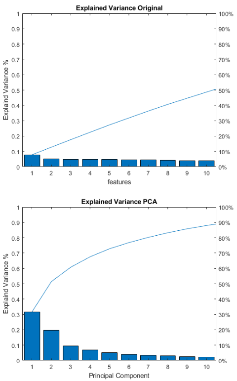

To aid in understanding how these components correlate with the original features, a heatmap can be an effective tool:

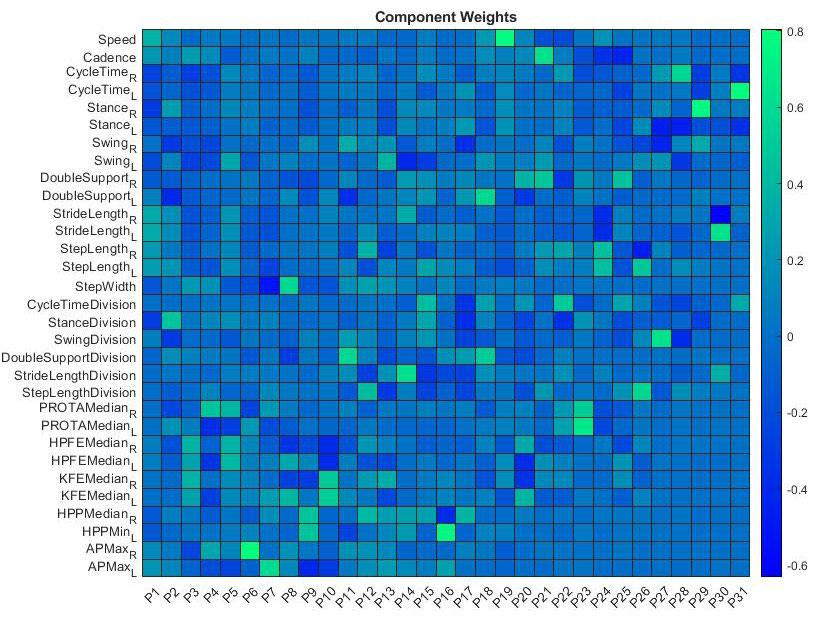

The heatmap visually depicts these relationships, allowing for easier interpretation of complex data structures.

However, the introduction of PCA did not significantly improve our model's performance. Therefore, we chose not to use PCA in the final model, prioritizing simplicity and computational efficiency while ensuring that our model remains interpretable to those who may not have technical expertise in PCA.

## Model Fitting and Evaluation

Model fitting in machine learning is the process of adjusting a model to data. It's like finding the right key for a lock. This key, or model, should not only fit the data it was trained on but also work well with new, unseen data—this is where model evaluation comes in.

Evaluating a model involves using specific metrics to gauge its predictive accuracy and generalizability. Accuracy is a starting point, measuring how often the model is correct overall. However, when classes are imbalanced, accuracy can be misleading. That's why we delve deeper with metrics like confusion matrices, which show the breakdown of predictions, and ROC AUC curves, which consider the trade-off between true positive rate and false positive rate across different thresholds.

These tools help us ensure the model is not just memorizing the data (overfitting) but truly learning from it, capable of making sound predictions in the real world.

### Improving Model Generalization

Generalization is the model's ability to adapt properly to new, previously unseen data, drawn from the same distribution as the one used to create the model. To improve generalization, we employ techniques like cross-validation, which involves dividing the data into subsets and training the model multiple times, each time using a different subset as a validation set and the remaining points for training.

Cross-validation provides a robust estimate of the model's performance on an independent dataset and helps mitigate overfitting. In this project, we've implemented a 20-fold cross-validation using MATLAB's classification app, providing a thorough validation approach given the smaller size of our dataset.

We also reserve a test set from the outset, which is critical for evaluating the model's generalization performance. This set is untouched during training and validation and is used only for the final assessment, ensuring that we measure how well the model can apply what it has learned to new data.

### Hyperparameter Optimization

In machine learning, model parameters and hyperparameters play distinct roles. Parameters are learned directly from the training data, while hyperparameters, set prior to training, govern the learning process itself. Hyperparameter optimization is crucial for fine-tuning these settings to improve model performance.

For example, in K-Nearest Neighbors (KNN), the number of neighbors 'K' and the distance metric are hyperparameters requiring careful selection. Optimization involves searching for the best hyperparameters that minimize error, using methods like grid search, random search, or more advanced techniques like Bayesian Optimization.

Bayesian Optimization is particularly efficient; it uses past evaluations to inform future hyperparameter choices, aiming to find the optimal combination with fewer evaluations.

The graphs provided below illustrate the hyperparameter optimization for our best models, KNN and SVM. They show the iterative process of tuning and the eventual selection of hyperparameters that minimize the classification error, indicating the model's likely effectiveness on unseen data.

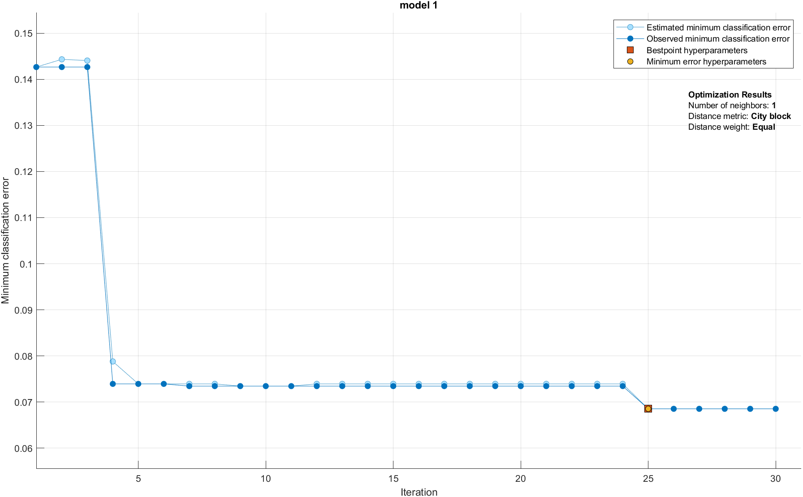

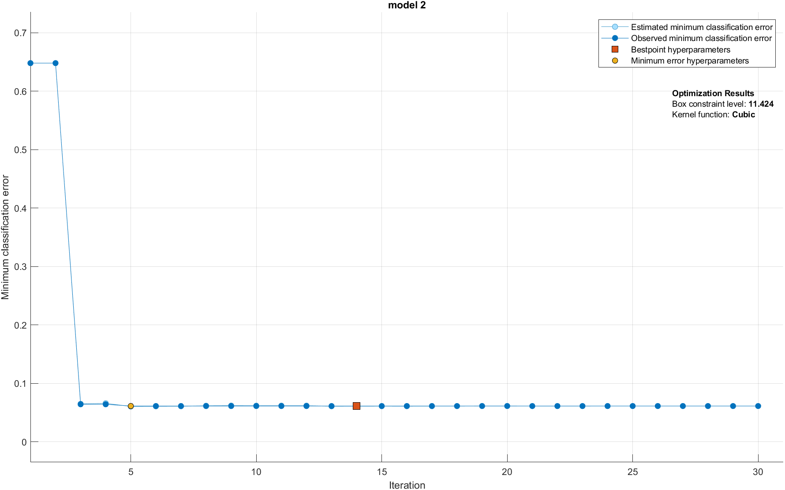

### Ensemble Models

Ensemble models in machine learning combine multiple individual models to improve predictive performance. The principle is akin to seeking multiple opinions before making a decision. One common ensemble method is Bagged Trees, an extension of decision trees. Each tree in the ensemble is trained on a random subset of the data, ensuring diversity among the models, as represented in the accompanying figure:

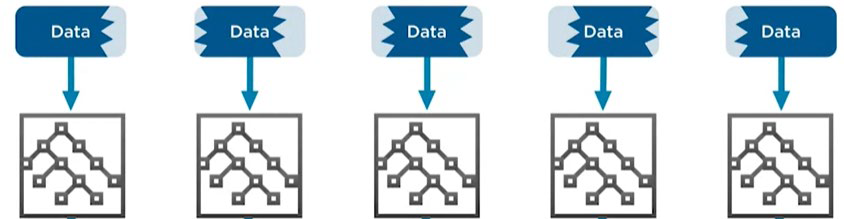

The ensemble's final prediction is typically made through majority voting, leveraging the collective wisdom of all the trees. While ensemble methods like Bagged Trees or Random Forests can offer increased accuracy, they may also require more resources in terms of training time, memory, and prediction speed compared to single models.

## Results

Among all the models explored in this study, which include SVM, KNN, Decision Tree, Logistic Regression, Bagged Trees Ensemble, Naive Bayes, and Discriminant Analysis, the results highlighted here focus on two models: SVM as the top performer and Bagged Trees as the ensemble model. These two were selected for a more detailed presentation due to their superior performance metrics in accuracy and generalizability.

The Support Vector Machine (SVM) algorithm showcases robust performance on this dataset, with high accuracy scores both in cross-validation and on the unseen test set. The Bagged Trees Ensemble also outperforms single tree models, aligning with expectations for ensemble methods. The respective confusion matrices and ROC curves for each model, displayed in the provided figures, offer a detailed look into model accuracy and the trade-off between true positive rates and false positive rates.

### SVM Results:

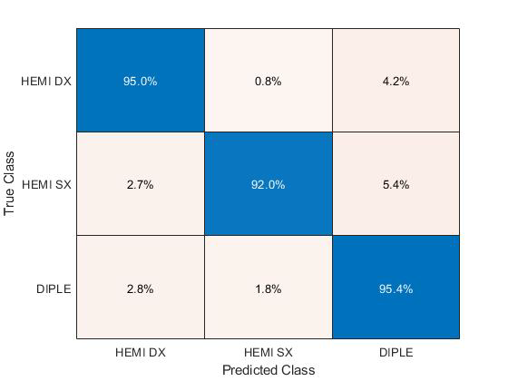

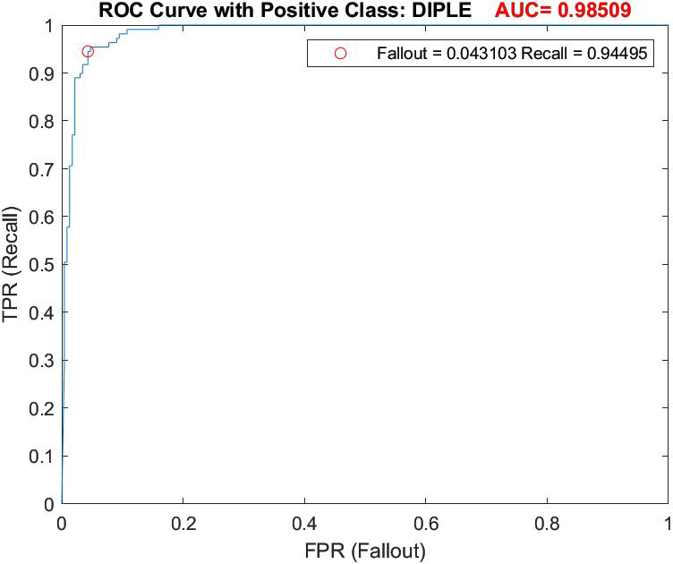

### Bagged Trees Ensemble Results:

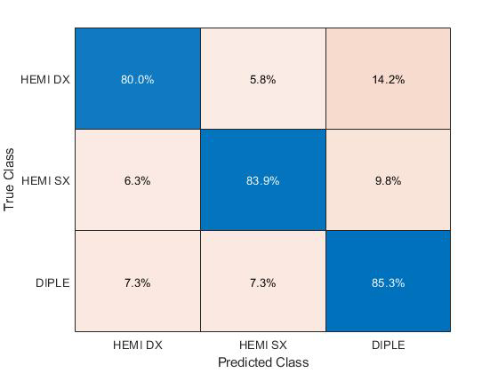

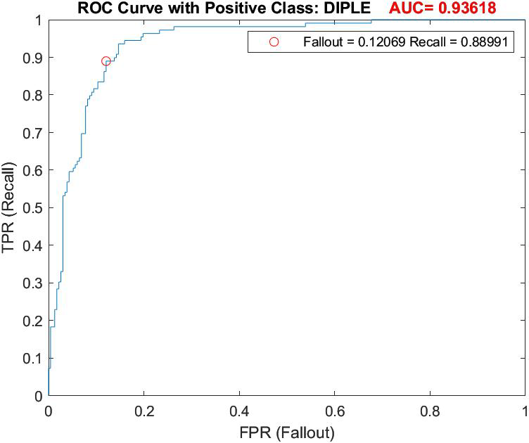

The hyperparameters for the best-performing SVM and Bagged Trees models have been carefully optimized, contributing to their high accuracy rates. The SVM benefits from a polynomial kernel and standardized data, while the Bagged Trees Ensemble's performance is enhanced by the number of learners and the choice of the Gini index for splitting criteria.

## Conclusion and Future Development

This thesis contributes to the field of gait classification in children with CP, addressing the gap in comparative studies of machine learning algorithms for distinguishing between diplegic and hemiplegic gait patterns. With a comprehensive approach utilizing a full spectrum of gait features, the SVM and KNN models emerged as top performers, validating the hypothesis that a rich feature set can enhance classification accuracy. The study's findings advocate for the integration of machine learning in clinical settings, offering a promising direction for objective and reproducible diagnosis.

Looking forward, while this work has set a strong foundation, future research could expand the dataset to include hand movement data, integrate EMG signals, explore frequency-domain features, and extend classification to encompass a broader range of gait types. These enhancements will aim to build upon the current models, ensuring more robust and widely applicable tools for automated gait analysis.

By acknowledging the present limitations and setting a clear roadmap for advancement, this thesis not only addresses an immediate research need but also paves the way for future innovations that could transform clinical practices in gait analysis.

## Tools and Technologies

- **MATLAB:** The primary programming environment utilized for this project. MATLAB is a multi-paradigm numerical computing environment and proprietary programming language developed by MathWorks. It allows for matrix manipulations, plotting of functions and data, implementation of algorithms, creation of user interfaces, and interfacing with programs written in other languages.
- **Classification Learner App:** This tool was employed to interactively examine data, select algorithms, and train and evaluate models. Its integration facilitated an intuitive and efficient approach to machine learning tasks.
- **Optimization Toolbox:** This collection of functions was utilized to find parameters that minimize or maximize objectives subject to constraints. It supported the project's need for hyperparameter optimization problems.
- **Interactivity Tools:** Tools such as dropdown menus and sliders were embedded within the visualizations. The inclusion of these elements allowed for dynamic manipulation of the displayed data, offering a more engaging user experience.

## Remarks and Instructions for Usage

- Data provision for this project was managed by the Gait Lab of the Polytechnic University of Milan.
- Privacy considerations necessitate that the dataset is not included within the public repository. Sample data may be accessible under specific conditions upon request ([LinkedIn](https://www.linkedin.com/in/hamidrezarahimi/)).
- Advancements in model performance are anticipated through experimentation with various preprocessing techniques and feature engineering methods.

For any inquiries, collaboration opportunities, or feedback, please don't hesitate to connect with me on [LinkedIn](https://www.linkedin.com/in/hamidrezarahimi/). Your insights are highly valued and appreciated.
